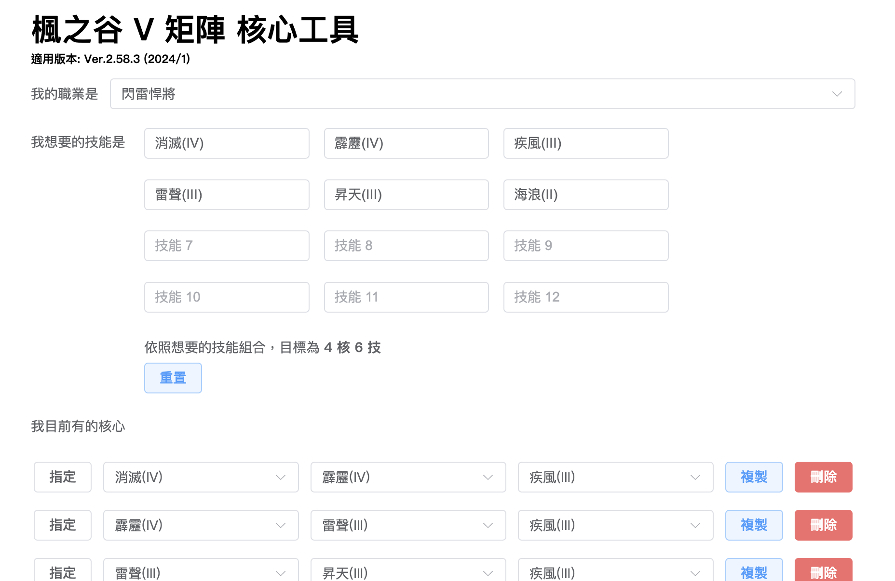
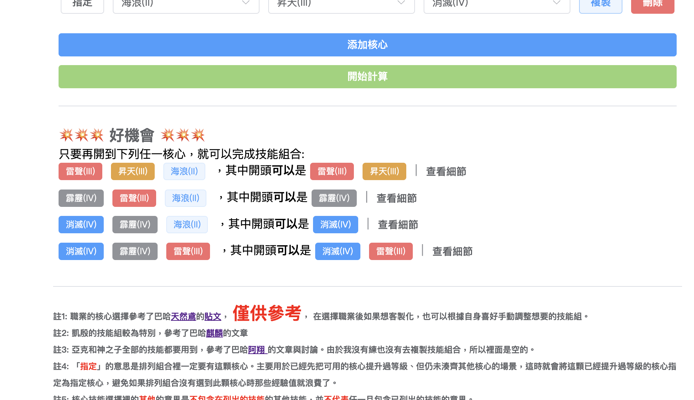

# Maple Story V Matrix Tool 楓之谷 V 矩陣技能核心工具

###### 幫助你快速找到四核六技

### 使用方法

#### 選擇職業

可以透過下拉選單直接選擇職業，或是選擇「自由的」來完全自由輸入想要的技能。

> 就算選擇了職業，也可以根據自己的喜好做微調。職業選擇器只是提供了一個方便的快速填入技能而已。

#### 輸入想要的技能

如果是透過下拉選單選擇，會根據巴哈網友的[文章](https://home.gamer.com.tw/homeindex.php?owner=as12bird)自動填入推薦的技能組合。

也可以以此為基準來調整細節。

> 如果核心的數目與技能的數目沒辦法完美搭配(e.g. 四核五技)，可以透過勾選「允許單一技能重複出現 3 次」來選擇要不要一定包含有其他技能。  
> 更多細節請見範例

#### 輸入目前有的核心

根據在遊戲裡開到的核心，逐一添加到「我目前有的核心」欄位。  
因為有提供「還差哪顆」的功能，推薦開到一個全都是想要的技能的核心就輸入一個，減少核心的浪費。

##### 指定核心

如果想要排列組合一定包含某顆核心，請點選該核心旁邊的「指定」按鈕，  
這樣計算出來的核心組合就一定會包含有指定的核心。

> 此功能用於如果已經有某些既有的核心有練過等級了、希望計算出來的核心組合一定包含這些已經練過等級的核心，  
> 才不會最後挑選出來的核心們沒有包含這些練過的核心、導致這些經驗值浪費。

#### 開始計算

根據想要的技能和目前有的核心，可以算出目前是不是已經有匹配的核心組合可以湊出想要的技能組合。  
或是只差哪一顆核心等等的功能。

